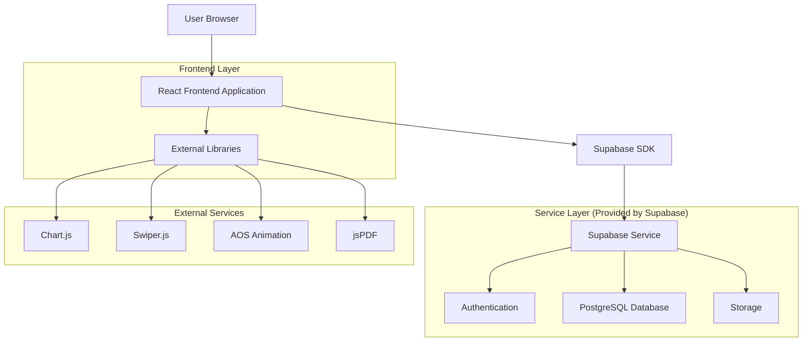
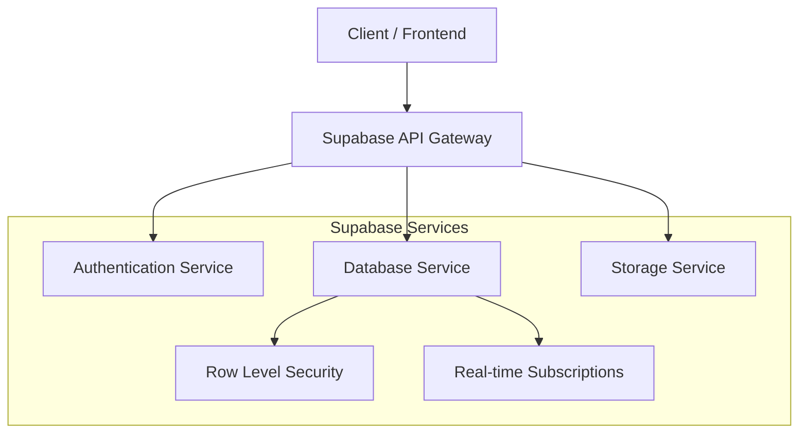
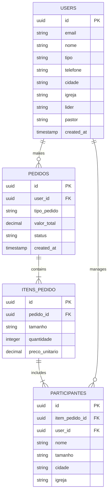

# Documento de Arquitetura Técnica - UMADEPAR 2025

## 1. Architecture design



## 2. Technology Description

* Frontend: React\@18 + TailwindCSS\@3 + Vite

* Backend: Supabase (Authentication + PostgreSQL + Storage)

* Libraries: Chart.js\@4, Swiper.js\@11, AOS\@2.3, jsPDF\@2.5

* Deployment: Vercel (Frontend) + Supabase (Backend)

## 3. Route definitions

| Route             | Purpose                                                              |
| ----------------- | -------------------------------------------------------------------- |
| /                 | Página inicial institucional com informações do evento UMADEPAR 2025 |
| /login            | Página de autenticação e cadastro para jovens e líderes              |
| /venda-individual | Página de compra individual para jovens                              |
| /venda-grupo      | Página de compra em grupo para líderes                               |
| /dashboard        | Dashboard administrativo com KPIs, vendas e relatórios               |
| /perfil           | Página de perfil do usuário logado                                   |

## 4. API definitions

### 4.1 Core API

**Autenticação de usuários**

```
POST /auth/v1/signup
```

Request:

| Param Name | Param Type | isRequired | Description                                 |
| ---------- | ---------- | ---------- | ------------------------------------------- |
| email      | string     | true       | Email do usuário                            |
| password   | string     | true       | Senha do usuário                            |
| metadata   | object     | true       | Dados adicionais (nome, tipo, igreja, etc.) |

Response:

| Param Name | Param Type | Description             |
| ---------- | ---------- | ----------------------- |
| user       | object     | Dados do usuário criado |
| session    | object     | Sessão de autenticação  |

**Login de usuários**

```
POST /auth/v1/token?grant_type=password
```

Request:

| Param Name | Param Type | isRequired | Description      |
| ---------- | ---------- | ---------- | ---------------- |
| email      | string     | true       | Email do usuário |
| password   | string     | true       | Senha do usuário |

Response:

| Param Name    | Param Type | Description      |
| ------------- | ---------- | ---------------- |
| access\_token | string     | Token de acesso  |
| user          | object     | Dados do usuário |

**Criar pedido**

```
POST /rest/v1/pedidos
```

Request:

| Param Name   | Param Type | isRequired | Description                    |
| ------------ | ---------- | ---------- | ------------------------------ |
| user\_id     | uuid       | true       | ID do usuário que fez o pedido |
| tipo\_pedido | string     | true       | 'individual' ou 'grupo'        |
| itens        | array      | true       | Lista de itens do pedido       |
| valor\_total | decimal    | true       | Valor total do pedido          |

Response:

| Param Name | Param Type | Description         |
| ---------- | ---------- | ------------------- |
| id         | uuid       | ID do pedido criado |
| status     | string     | Status do pedido    |

Example:

```json
{
  "user_id": "123e4567-e89b-12d3-a456-426614174000",
  "tipo_pedido": "individual",
  "itens": [
    {
      "tamanho": "M",
      "quantidade": 2,
      "participantes": ["João Silva", "Maria Santos"]
    }
  ],
  "valor_total": 159.80
}
```

## 5. Server architecture diagram



## 6. Data model

### 6.1 Data model definition



### 6.2 Data Definition Language

**Tabela de Usuários (users)**

```sql
-- create table
CREATE TABLE users (
    id UUID PRIMARY KEY DEFAULT gen_random_uuid(),
    email VARCHAR(255) UNIQUE NOT NULL,
    nome VARCHAR(255) NOT NULL,
    tipo VARCHAR(20) DEFAULT 'jovem' CHECK (tipo IN ('jovem', 'lider', 'admin')),
    telefone VARCHAR(20),
    endereco TEXT,
    cidade VARCHAR(100),
    igreja VARCHAR(255),
    lider VARCHAR(255),
    pastor VARCHAR(255),
    foto_url TEXT,
    created_at TIMESTAMP WITH TIME ZONE DEFAULT NOW(),
    updated_at TIMESTAMP WITH TIME ZONE DEFAULT NOW()
);

-- create index
CREATE INDEX idx_users_email ON users(email);
CREATE INDEX idx_users_tipo ON users(tipo);
CREATE INDEX idx_users_cidade ON users(cidade);

-- Row Level Security
ALTER TABLE users ENABLE ROW LEVEL SECURITY;

-- Policies
CREATE POLICY "Users can view own profile" ON users
    FOR SELECT USING (auth.uid() = id);

CREATE POLICY "Users can update own profile" ON users
    FOR UPDATE USING (auth.uid() = id);

CREATE POLICY "Admins can view all users" ON users
    FOR SELECT USING (
        EXISTS (
            SELECT 1 FROM users 
            WHERE id = auth.uid() AND tipo = 'admin'
        )
    );

-- Grant permissions
GRANT SELECT ON users TO anon;
GRANT ALL PRIVILEGES ON users TO authenticated;
```

**Tabela de Pedidos (pedidos)**

```sql
-- create table
CREATE TABLE pedidos (
    id UUID PRIMARY KEY DEFAULT gen_random_uuid(),
    user_id UUID NOT NULL,
    tipo_pedido VARCHAR(20) NOT NULL CHECK (tipo_pedido IN ('individual', 'grupo')),
    valor_total DECIMAL(10,2) NOT NULL,
    status VARCHAR(20) DEFAULT 'pendente' CHECK (status IN ('pendente', 'pago', 'cancelado')),
    created_at TIMESTAMP WITH TIME ZONE DEFAULT NOW(),
    updated_at TIMESTAMP WITH TIME ZONE DEFAULT NOW()
);

-- create index
CREATE INDEX idx_pedidos_user_id ON pedidos(user_id);
CREATE INDEX idx_pedidos_status ON pedidos(status);
CREATE INDEX idx_pedidos_created_at ON pedidos(created_at DESC);

-- Row Level Security
ALTER TABLE pedidos ENABLE ROW LEVEL SECURITY;

-- Policies
CREATE POLICY "Users can view own orders" ON pedidos
    FOR SELECT USING (user_id = auth.uid());

CREATE POLICY "Users can create own orders" ON pedidos
    FOR INSERT WITH CHECK (user_id = auth.uid());

CREATE POLICY "Admins can view all orders" ON pedidos
    FOR SELECT USING (
        EXISTS (
            SELECT 1 FROM users 
            WHERE id = auth.uid() AND tipo = 'admin'
        )
    );

-- Grant permissions
GRANT SELECT ON pedidos TO anon;
GRANT ALL PRIVILEGES ON pedidos TO authenticated;
```

**Tabela de Itens do Pedido (itens\_pedido)**

```sql
-- create table
CREATE TABLE itens_pedido (
    id UUID PRIMARY KEY DEFAULT gen_random_uuid(),
    pedido_id UUID NOT NULL,
    tamanho VARCHAR(5) NOT NULL CHECK (tamanho IN ('P', 'M', 'G', 'GG', 'XG')),
    quantidade INTEGER NOT NULL CHECK (quantidade > 0),
    preco_unitario DECIMAL(10,2) NOT NULL DEFAULT 79.90,
    created_at TIMESTAMP WITH TIME ZONE DEFAULT NOW()
);

-- create index
CREATE INDEX idx_itens_pedido_pedido_id ON itens_pedido(pedido_id);
CREATE INDEX idx_itens_pedido_tamanho ON itens_pedido(tamanho);

-- Row Level Security
ALTER TABLE itens_pedido ENABLE ROW LEVEL SECURITY;

-- Policies
CREATE POLICY "Users can view own order items" ON itens_pedido
    FOR SELECT USING (
        EXISTS (
            SELECT 1 FROM pedidos 
            WHERE id = pedido_id AND user_id = auth.uid()
        )
    );

-- Grant permissions
GRANT SELECT ON itens_pedido TO anon;
GRANT ALL PRIVILEGES ON itens_pedido TO authenticated;
```

**Tabela de Participantes (participantes)**

```sql
-- create table
CREATE TABLE participantes (
    id UUID PRIMARY KEY DEFAULT gen_random_uuid(),
    item_pedido_id UUID NOT NULL,
    user_id UUID NOT NULL,
    nome VARCHAR(255) NOT NULL,
    tamanho VARCHAR(5) NOT NULL CHECK (tamanho IN ('P', 'M', 'G', 'GG', 'XG')),
    cidade VARCHAR(100),
    igreja VARCHAR(255),
    created_at TIMESTAMP WITH TIME ZONE DEFAULT NOW()
);

-- create index
CREATE INDEX idx_participantes_item_pedido_id ON participantes(item_pedido_id);
CREATE INDEX idx_participantes_user_id ON participantes(user_id);
CREATE INDEX idx_participantes_cidade ON participantes(cidade);
CREATE INDEX idx_participantes_tamanho ON participantes(tamanho);

-- Row Level Security
ALTER TABLE participantes ENABLE ROW LEVEL SECURITY;

-- Policies
CREATE POLICY "Users can view own participants" ON participantes
    FOR SELECT USING (user_id = auth.uid());

CREATE POLICY "Admins can view all participants" ON participantes
    FOR SELECT USING (
        EXISTS (
            SELECT 1 FROM users 
            WHERE id = auth.uid() AND tipo = 'admin'
        )
    );

-- Grant permissions
GRANT SELECT ON participantes TO anon;
GRANT ALL PRIVILEGES ON participantes TO authenticated;

-- init data
INSERT INTO users (email, nome, tipo, cidade, igreja) VALUES
('admin@umadepar.com', 'Administrador', 'admin', 'Curitiba', 'AD Central'),
('joao@email.com', 'João da Silva', 'lider', 'Cascavel', 'AD Central'),
('maria@email.com', 'Maria Oliveira', 'lider', 'Curitiba', 'AD Madureira');
```

