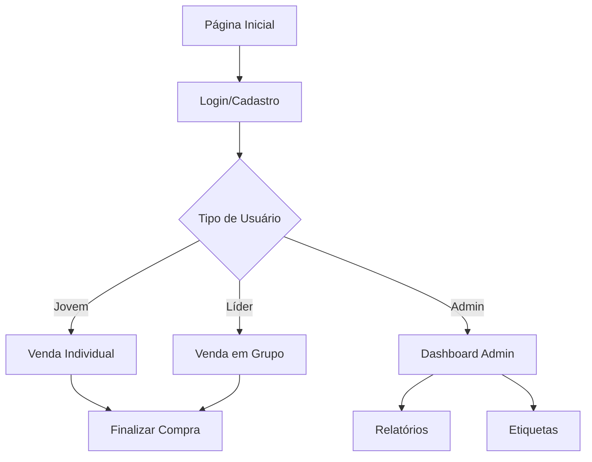

# Documento de Requisitos do Produto - UMADEPAR 2025

## 1. Product Overview
Sistema web para gestão e vendas do congresso UMADEPAR 2025 (União da Mocidade da Assembleia de Deus no Estado do Paraná). A plataforma permite vendas de camisetas oficiais, cadastro de participantes e administração completa do evento.

O sistema resolve a necessidade de centralizar vendas, controlar estoque, gerenciar participantes e fornecer relatórios administrativos para o maior evento de juventude evangélica do Paraná.

## 2. Core Features

### 2.1 User Roles
| Role | Registration Method | Core Permissions |
|------|---------------------|------------------|
| Jovem | Cadastro individual via email | Pode comprar camisetas individualmente, visualizar perfil |
| Líder | Cadastro via email com perfil de líder | Pode fazer pedidos em grupo, gerenciar lista de participantes |
| Administrador | Acesso direto ao dashboard | Visualizar KPIs, relatórios, gerar etiquetas, controle total |

### 2.2 Feature Module
Nosso sistema UMADEPAR 2025 consiste nas seguintes páginas principais:
1. **Página Inicial**: seção hero, navegação, informações do evento, depoimentos de líderes, mockups das camisetas
2. **Login/Cadastro**: autenticação, registro de jovens e líderes, recuperação de senha
3. **Venda Individual**: carrossel de produtos, seleção de tamanho, carrinho de compras
4. **Venda em Grupo**: formulário para líderes, múltiplas quantidades por tamanho, lista de participantes
5. **Dashboard Administrativo**: KPIs, relatórios de vendas, gerador de etiquetas, gráficos financeiros

### 2.3 Page Details
| Page Name | Module Name | Feature description |
|-----------|-------------|---------------------|
| Página Inicial | Hero Section | Exibir título do evento, data e local, botão call-to-action para vendas |
| Página Inicial | Navegação | Menu responsivo com links para seções, área do usuário, botão de compra |
| Página Inicial | Informações do Evento | Cards com data, local e preletores do congresso |
| Página Inicial | Depoimentos | Seção com fotos e citações dos líderes do evento |
| Página Inicial | Mockups das Camisetas | Galeria com designs frontal, traseiro e detalhes do produto |
| Login/Cadastro | Formulário de Login | Campos email/senha, validação, redirecionamento baseado no perfil |
| Login/Cadastro | Registro Jovem | Cadastro básico com dados pessoais, igreja e líder |
| Login/Cadastro | Registro Líder | Cadastro completo com foto, endereço, WhatsApp e dados da igreja |
| Login/Cadastro | Recuperação de Senha | Envio de email para reset de senha |
| Venda Individual | Carrossel de Produto | Swiper com imagens da camiseta (frente, costas, detalhes) |
| Venda Individual | Seleção de Tamanho | Botões para tamanhos P, M, G, GG, XG com guia de medidas |
| Venda Individual | Carrinho | Controle de quantidade, cálculo de preço, botão de compra |
| Venda em Grupo | Formulário de Pedido | Seleção de quantidades por tamanho, campos para nomes dos participantes |
| Venda em Grupo | Gestão de Participantes | Lista dinâmica de participantes com tamanhos selecionados |
| Dashboard Admin | KPIs | Cards com total arrecadado, camisetas vendidas, participantes e cidades |
| Dashboard Admin | Tabela de Vendas | Lista de todas as vendas com filtros e busca |
| Dashboard Admin | Gerador de Etiquetas | Seleção de participantes, preview e impressão de etiquetas |
| Dashboard Admin | Relatórios Financeiros | Gráficos de receita por cidade e vendas por tamanho |
| Dashboard Admin | Exportação PDF | Geração de relatórios em PDF para vendas |

## 3. Core Process

**Fluxo do Jovem:**
1. Acessa a página inicial e conhece o evento
2. Clica em "Comprar Agora" ou faz login
3. Se não tem conta, realiza cadastro como jovem
4. Acessa página de venda individual
5. Seleciona tamanho e quantidade da camiseta
6. Finaliza compra com dados de pagamento

**Fluxo do Líder:**
1. Acessa a página inicial e faz login
2. Se não tem conta, realiza cadastro como líder (2 etapas)
3. Acessa página de venda em grupo
4. Seleciona quantidades por tamanho
5. Preenche nomes dos participantes
6. Finaliza pedido do grupo

**Fluxo do Administrador:**
1. Acessa dashboard administrativo diretamente
2. Visualiza KPIs e métricas em tempo real
3. Consulta vendas com filtros e busca
4. Gera etiquetas para participantes selecionados
5. Exporta relatórios financeiros em PDF

## 4. User Interface Design

### 4.1 Design Style
- **Cores Primárias:** Azul escuro (#0f2b45) e Dourado (#edbe66)
- **Cores Secundárias:** Cinza claro (#d9d9d9) e Off-white (#f7fafc)
- **Estilo de Botões:** Arredondados com efeito hover de elevação e brilho
- **Tipografia:** Inter (Google Fonts) com pesos 300-800
- **Layout:** Design responsivo com cards, navegação superior fixa
- **Ícones:** SVG minimalistas, ícones de usuário e navegação

### 4.2 Page Design Overview
| Page Name | Module Name | UI Elements |
|-----------|-------------|-------------|
| Página Inicial | Hero Section | Background com imagem do evento (opacidade 40%), título em fonte extrabold 6xl, botão dourado com shadow |
| Página Inicial | Navegação | Header fixo com backdrop-blur, logo dourado, menu horizontal, botão de perfil circular |
| Página Inicial | Cards de Informação | Grid responsivo, cards brancos com shadow, títulos dourados, texto em azul escuro |
| Login/Cadastro | Formulários | Cards centralizados com shadow-2xl, inputs com focus ring dourado, botões primários |
| Venda Individual | Carrossel | Swiper com aspect-ratio 1:1, navegação dourada, pagination bullets |
| Venda Individual | Seleção de Tamanho | Botões com border que fica azul quando ativo, grid responsivo |
| Venda em Grupo | Formulário Dinâmico | Inputs organizados por tamanho, campos de nome gerados dinamicamente |
| Dashboard Admin | Sidebar | Background azul escuro, links com hover dourado, border-left ativo |
| Dashboard Admin | KPI Cards | Cards brancos com hover transform translateY, números grandes em azul |
| Dashboard Admin | Tabelas | Zebra striping, hover em cinza claro, botões de ação em azul |
| Dashboard Admin | Gráficos | Chart.js com cores do tema (dourado e azul), responsive |

### 4.3 Responsiveness
O produto é mobile-first com adaptação para desktop. Inclui menu hambúrguer para mobile, grid responsivo que colapsa de 4 colunas para 1 em telas pequenas, e otimização para touch em botões e formulários.